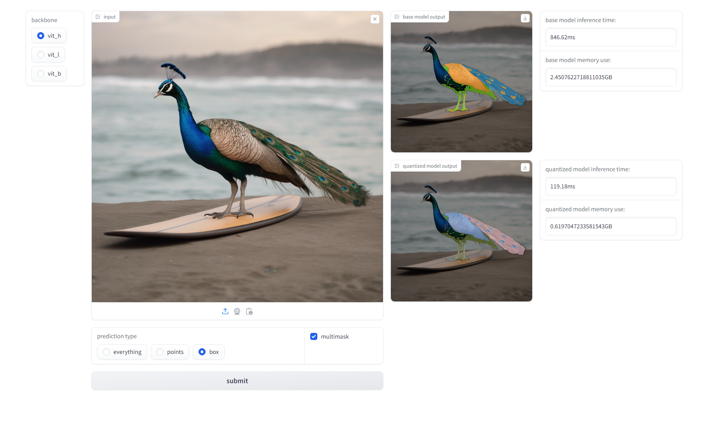

# Quantization of SAM with gradio demo



### usage
Clone this repo to your local directory, and run the following commands in it.
```
conda create -n samq python=3.10
```
```
conda activate samq
```
```
pip install -r requirements.txt
```
```
python run.py
```

It will be quite a slow start for the first time because it needs to set up the optimal quantization parameters. After that, it will start faster.